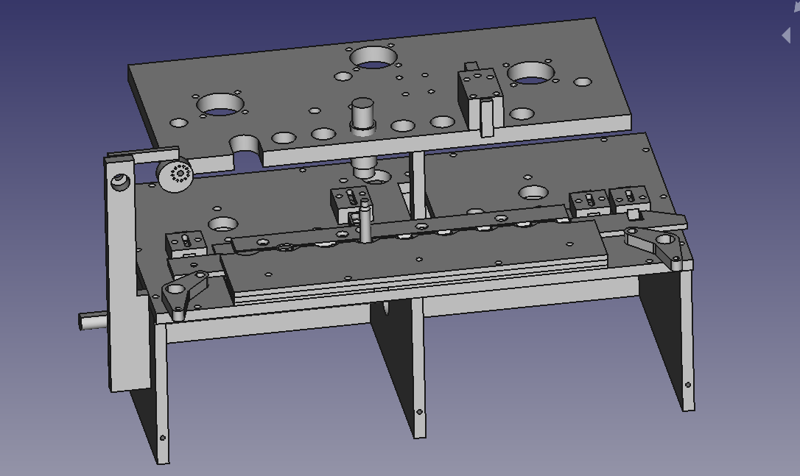

# OpenLoad_8

Пропоную Вашій увазі проект пресу для спорядження/пересрорядження нарізних набоїв на 8 станцій.

Наразі оснастка сфокусована на калібрі .223 Rem. з використанням стандартних матриць для ручного спорядження типу Lee/RCBS/тощо...

Для огляду збірки відкривайте OpenLoadAssembly.FCStd

Запрошую до співпраці! Буду щиро вдячний за участь та будь-яку допомогу у проєкті.
